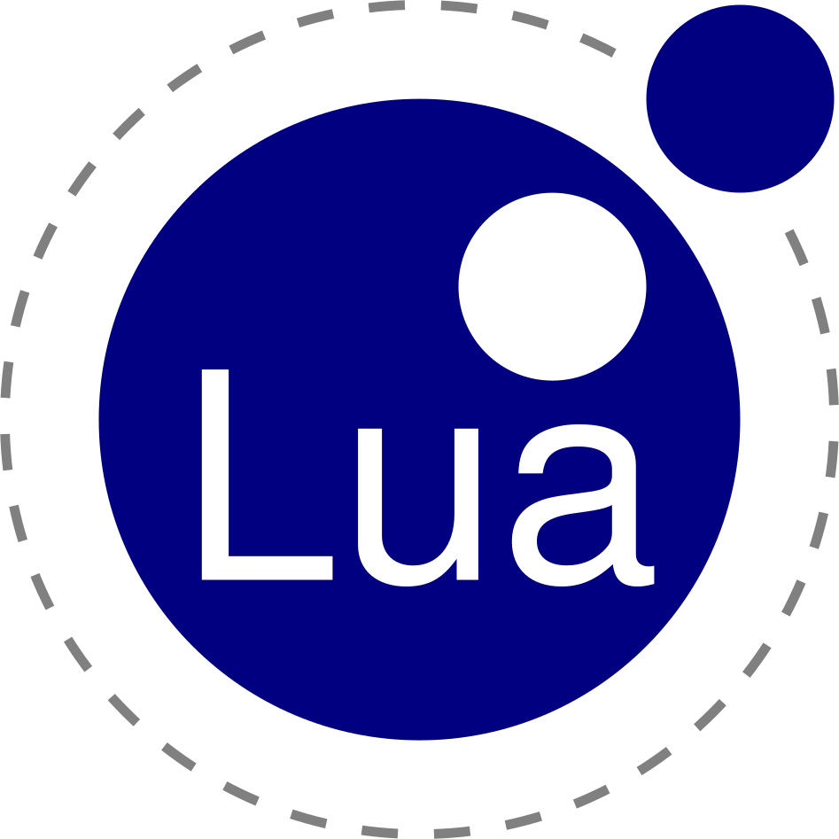

<h2 align="center" style="font-variant:small-caps; margin:0">There's Always a Way</h2>

  
  
  
  
  
  
  
  
  
  
  
  

<!-- 

  
  
  
  
  
  
  
  
  
  
  

 -->

<b>- I'm just a PC enthusiast who has been diving into the inners of the computer world since the age of 3 -</b>

  

    
Currently enhancing:

    

      
      
      
      
    

  

  

    
While learning:

    

      
      
      
      
    

  

Wanna get in touch?

  
  
  

<!--
**Sopze92/Sopze92** is a ✨ _special_ ✨ repository because its `README.md` (this file) appears on your GitHub profile.

Here are some ideas to get you started:

- 🔭 I’m currently working on ...
- 🌱 I’m currently learning ...
- 👯 I’m looking to collaborate on ...
- 🤔 I’m looking for help with ...
- 💬 Ask me about ...
- 📫 How to reach me: ...
- 😄 Pronouns: ...
- ⚡ Fun fact: ...
-->
